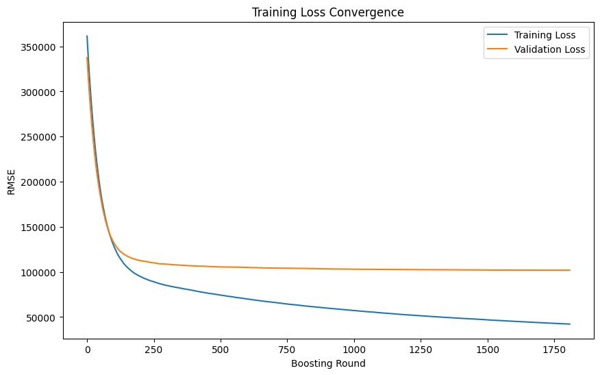
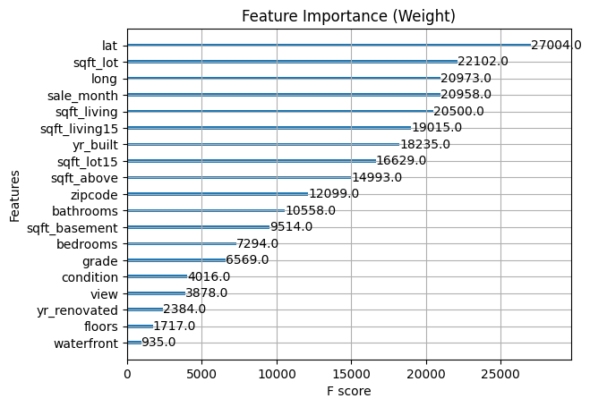
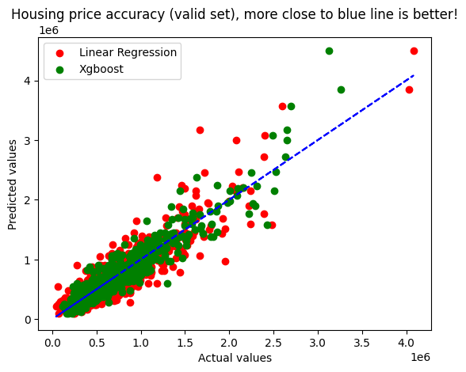
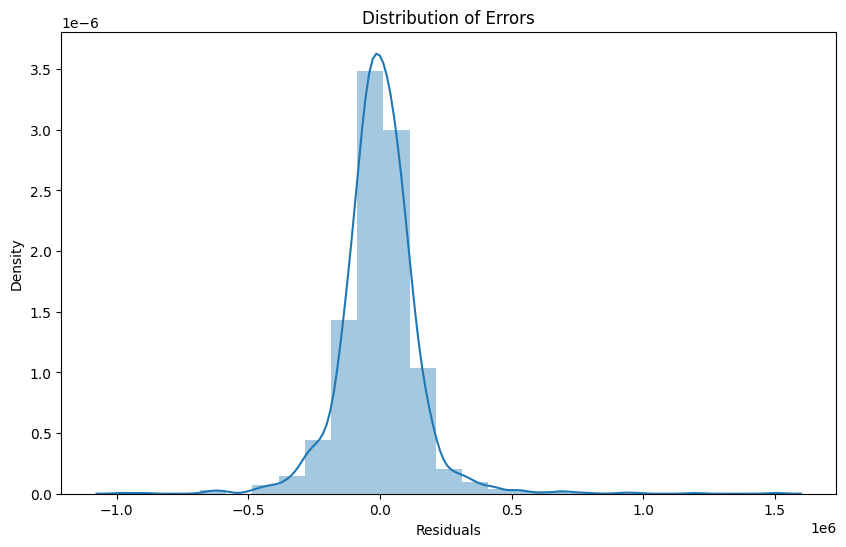
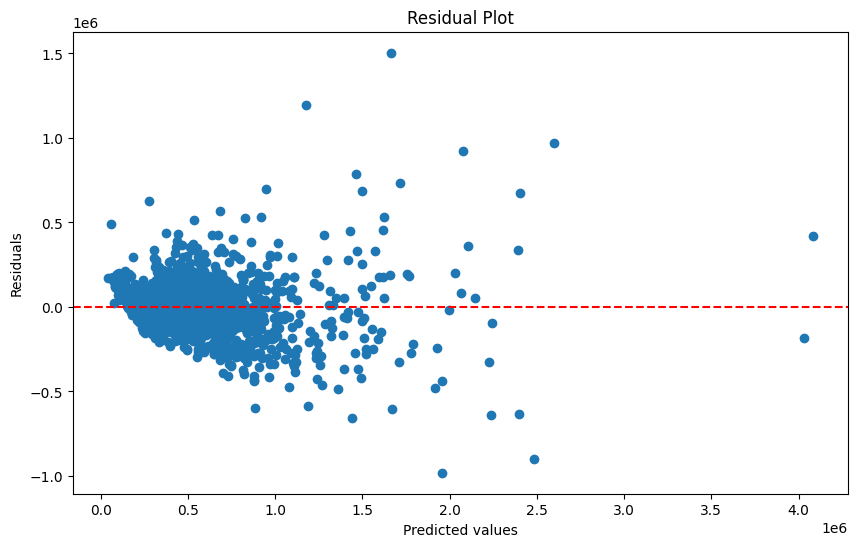

# My Project: Linear Regression

## 程式執行
### method 1:
-    直接複製在google colab上跑，但要把import from colab那個block解除註解，並且在同個資料夾內放入training_data、valid_data和test_data  
### method 2:
-    git clone整包code，並在有裝anaconda python 3.7.1以上環境下run code，細項的code說明，在.ipynb file有做說明

## 1.做法說明

        在資料的前處理的部分，我有把相關性高的資料挑出來，再去做StandardScaler()，因為標準化後的特徵將具有 Mean Centering 和 Variance Scaling，這有助於模型更好地理解數據，提高模型的訓練效率。
        至於演算法部分主要嘗試了兩種寫法，第一種是利用Polynomial的方式去嘗試train Linear Regression()、Ridge()、Lasso()三個預測線。第二種是直接用Xgboost去train經過處理的data，再利用自動調整參數的function去幫助我們Fine-tune到好的參數。

## 2.程式方塊圖與寫法

        The structure involves loading data, exploring it, preparing the dataset, training linear regression models, using XGBoost for regression, evaluating model performance, and finally plot some useful figure to evaluate the predictive result，細項的code說明，在.ipynb file有做說明。

## 3.畫圖做結果分析

### loss function收斂曲線

### Xgboost Loss function Plot:
    Xgboost loss function: the lower is better!

### Feature Importance Plot(for XGBoost):
    Can help understand which features are contributing the most to the predictions, and help in identifying the most influential features in the model.

### Actual vs. Predicted Plot:
    Housing price accuracy(valid set), more close to blue line is better!

### Distribution of Errors:
    This plot helps in understanding if the errors follow a normal distribution or if there are significant deviations.

### Residual Plot:
    In this plot, we can observe if there's any pattern or trend in the residuals. A random scatter around the zero line is a good indication of a well-performing model.

## 4.討論預設值誤差很大的，是怎麼回事?

- Model Complexity:

    因為這是線性回歸預設的問題，而最後我挑選Xgboost的函數，並且為了提高valid的預測精準度，把learning rate調小，train的num_round調蠻大的，所以valid精準度明顯提高。但此時整個model可能會train的太複雜，導致真正test_data時可能會出現overfitting的現象，以致預設結果不如預期。

- Feature Engineering:

    有可能一開始在資料前處裡的時候，就沒有找到好的相關線性匹配性之data來train，所以就算用精準的model去train也不一定會得到好的結果。

## 5.如何改進?

- Feature Engineering:

    使用對房價相關性高的data做分析，畫圖藉此觀察並去除較不必要的參數或是相關性低的參數，並依照房價的預測相關性乘上相對應的weight，或是對某些資料取log，會使整個數據更呈現線性的分布，再來可以對年份和月份做one-hot enconding才不會有1月和12月的差異。

- Hyperparameter Tuning:

    因為我後來是選用Xgboost參數去做主要的演算法，裡面其實還有很多參數可以調整，像是max_depth、learning_rate、subsample、min_child_weight、lambda、alpha、lambda_bias...等，可以利用自動調參數函數去調整出最合適的參數，但有基於不同的learning rate可能導致Train的時候很容易停在一次微分為0(但非loss最小值)的地方，所以如果可以找到更好的optimizer，像是Adam optimizer，也許能對預測精準度更加提升。

- 使用多種Cross-validation、stacking策略:

    試用不同的交叉驗證策略，如k-fold、StratifiedKFold 等，以確定模型的穩定性和一致性。對交叉驗證的結果進行詳細分析，了解模型在不同折上的表現，進一步調整模型。
    再來，可以利用stacking方式，將不同model算出來的結果，再次當成input輸入其他模型，從同學上台報告的呈現，發現多stack一點不同的model可以明顯提高預測的精準度。

- Further visualization:

    不管在資料的前處理還是最後結果的分析上，如果能找到更適合的視覺化圖形幫助我們去分析數據，可能會對於上面的Feature Engineering、Hyperparameter Tuning會有很大的幫助，可以了解不同特徵對模型的貢獻程度，進一步優化特徵選擇。

## 6. 心得報告
- 報告心得:

    第一次寫機器學習的作業，對於建立環境和語法真的蠻生疏的，還好網路上有許多open source可以參考和查閱，一開始有自己嘗試建model去train network，但發現預設結果不佳，所以最後採用Xgboost去fine tune參數，不過後來聽到同學上課分享才知道可以將不同model train的結果互相stacking起來，但要注意的是stacking的演算法要不一樣或是資料要不同，就可以進一步提高預設精準度，雖然這次作業相對不難，但其實有很多資料處理上的小細節，聽了同學的報告才驚覺有這麼多學問在裡面。

## 7. reference
1. [House Prices Prediction Using Deep Learning](https://towardsdatascience.com/house-prices-prediction-using-deep-learning-dea265cc3154)
2. [Polynomial Regression](https://chwang12341.medium.com/machine-learning-linear-regression%E8%BF%B4%E6%AD%B8%E6%A8%A1%E5%9E%8B-%E5%BC%B7%E5%A4%A7%E7%9A%84sklearn-%E7%B0%A1%E5%96%AE%E7%B7%9A%E6%80%A7%E8%BF%B4%E6%AD%B8%E6%A8%A1%E5%9E%8B-%E5%A4%9A%E9%A0%85%E5%BC%8F%E8%BF%B4%E6%AD%B8%E6%A8%A1%E5%9E%8B-%E5%A4%9A%E5%85%83%E8%BF%B4%E6%AD%B8%E6%A8%A1%E5%9E%8B-%E5%AE%8C%E6%95%B4%E5%AF%A6%E4%BD%9C%E6%95%99%E5%AD%B8-984c73ab5e05)

<!-- You can preview the rendered Markdown by pressing `Ctrl + Shift + V` in VSCode.
Adam optimizer: learning rate can change (decade step)
 -->

