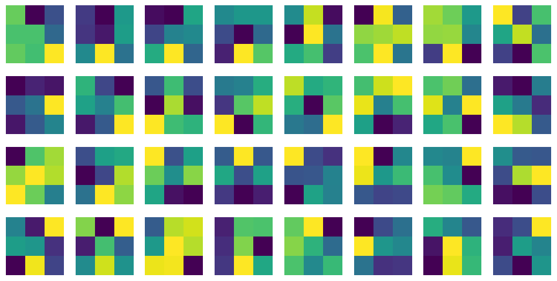

# My Project: CNN image character prediction

## 程式執行

### 執行方法

    git clone整包code，並在有裝anaconda python 3.7.1以上環境下run code，細項的code說明，在.ipynb file有做說明

## 1.做法說明

- Method:
    在資料的前處理的部分，我先做data argumentation，並將data split成train_data和validation_data，再送進去Train之前，我對照片做normalization，這有助於模型更好地理解數據，提高模型的訓練效率。Collect data的部分，我用自定義數據class SimpsonsDataset，並使用PyTorch的DataLoader來加載訓練、驗證和測試數據。Train的部分，我寫了一個卷積神經網絡模型Classifier()，它包括卷積層和全連接層，預設成果可以到達87%，後來為了提高自己的準確率，去嘗試了VGG16模型，很快就把結果Train到很高，可以到快97%的準確率。
    至於我寫的Classifier()卷積層和全連接層演算法部分主要疊了Convolution()、Batch_nomalization()、Relu()、MaxPool()，共疊了六層，中間可能時不時加上Dropout()，以避免太快overfitting，在實際的training下，結果達到87%，雖然略輸pretrain model一點，但執行時間上卻可以減少一半以上的時間。

## 2.程式方塊圖與寫法

- 數據匯入和準備:
    導入Pytorch的library，包括 NumPy、PyTorch、matplotlib 等，並從本地目錄加載圖像數據，用於訓練和測試。將訓練數據分為訓練和驗證集。

- 數據劃分和編碼:
    利用 one-hot encoding 去對照片做編碼，將類別名稱轉換為數值。數據預處理和轉換部分，包括調整圖像大小、將圖像轉換為PyTorch張量和正規化圖像數據。

- 模型的定義:
    我使用模型包含卷積層（CNN層）用於特徵提取和full-connected layer（線性層）用於分類。模型架構由activation function和批量標準化指定。此外，我也有嘗試用pre-trained model，像是VGG16模型、resnet50模型，直接拿來訓練。

- 損失函數和優化器的定義:
    代碼定義了損失函數（CrossEntropyLoss）來衡量模型的預測誤差。此外，使用優化器（AdamW）來在訓練過程中調整模型的參數。學習率調度包括在內，以在訓練過程中調整學習率。

- 訓練和驗證迴圈:
    為了代碼訓練並評估定義的模型，我使用循環來迭代指定的訓練時期數。在每個時期內，都有訓練和驗證階段。在訓練階段，根據使用訓練數據計算的損失來更新模型的權重。驗證階段評估模型對單獨的驗證數據集的性能。訓練迴圈跟蹤各種指標，包括損失和準確性。根據最高驗證準確性保存最佳模型參數。在訓練過程中，調整學習率以優化模型性能。

## 3.畫圖做結果分析

### loss function 收斂曲線

    This is calculate the validation loss, the lower is better

### 第一層kernel的權重圖

    Can help understand the work that first layer of kernel do

### Confusion matrix plot

    看Validation之預設結果(x axis)和實際答案(y axis)的差距

## 4.討論預設值誤差很大的，是怎麼回事?

- Model Complexity:

    可能可以嘗試疊更深或更複雜的模型，即使用更多的卷積層或更多的神經元，因為我只有利用單一模型去train，所以結果沒有像多個模型的加總結果那麼好，下次可以多嘗試不同模型的疊加，去改善預設值。

- data argumentation的隨機性:

    可以嘗試使用數據增強技術，如隨機裁剪、旋轉、翻轉等，來增加訓練數據的多樣性，因為我只有做2倍量的data argumentation，所以其實data的數量和隨機性沒有到太大，可能導致我train到96%就上不去的主要原因。

- learning rate的調配:

    因為我用Adam去做優化，他的learning rate會隨train的epoch越訓練越小，從我每個epoch的精準度來看，可以猜測出model最後會因為learning rate太小，而卡在local minimum，精準度就一直卡在87%左右，不過也是有可能是因為data overfitting的可能。

## 5.如何改進?

- CNN Stacking的層數多一點:

    CNN的stacking分為兩種，一種是疊深，即為增加data經過的神經網路的的層數；另一種增加每一層的廣度，就是增加每一層的neuron數量，如果要增加精準度，可能可以從這兩點去改善，但疊太深或太廣可能也要同時注意會有overfitting的問題，但因為受限電腦顯卡的限制或是跑的時間限制，所以也不能選太複雜的模型去train，這點有點可惜。

- 使用多種 pretrain model 交叉比對、stacking:

    試用不同的model交叉驗證策略，即將不同model的輸出，去比較各個比較高的機率值加起來最大，或是取每個model眾數(投票決)來當作結果的輸出，這樣可以進一步的提升預設的精準度，另外可以把所有model的輸出結果互相stacking，或是最後一層利用xgboost function將所有model做合併，這也是在國際競賽上大家常用的方法。

- Further visualization:

    不管在資料的前處理還是最後結果的分析上，如果能找到更適合的視覺化圖形幫助我們去分析數據，可能會對於上面的image-preprocessing、Batch_size Hyperparameter Tuning會有很大的幫助，可以了解不同特徵對模型的貢獻程度，或是探討如何減低照片的noise，進一步優化圖片的前處理。

## 6. 心得報告

- 報告心得:

    第二次寫機器學習的作業，CNN概念聽起來好像不難，但實際做起來還是難上許多，裡面有很多需要注意的細節，還好網路上有許多 open source 可以參考和查閱，一開始有自己嘗試建model去train network，但發現預設結果不佳，所以最後採用 VGG16 的 pretrain model 去 train 圖片，成果有大概比自己 Train 的 model 高上10%左右，雖然這次作業相對不難，但其實有很多資料處理上的小細節，聽了同學的報告才驚覺有這麼多學問在裡面。

## 7. reference

1. [Simpsons-classification-using-pytorch](https://www.kaggle.com/code/extremesarova/simpsons-classification-using-pytorch-guidelines/notebook)

2. [CNN-Simpsons-classification-using-pytorch](https://www.kaggle.com/code/tiagofsgoncalves/deep-neural-networks-image-classification-simpsons)

<!-- You can preview the rendered Markdown by pressing `Ctrl + Shift + V` in VSCode.
Adam optimizer: learning rate can change (decade step)
 -->
