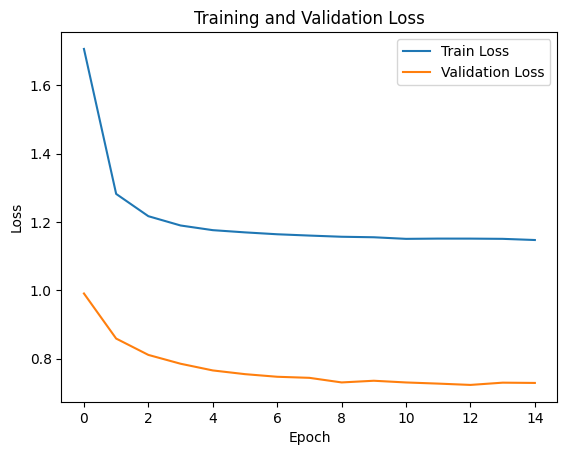
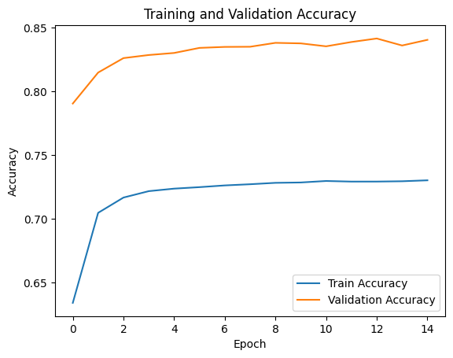

# My Project: CNN image character prediction

## 程式執行

### 執行方法

    git clone整包code，並在有裝anaconda python 3.7.1以上環境下run code，細項的code說明，在.ipynb file有做說明，也能在相關data上傳雲端，用colab上直接跑，不過如果是用colab跑，因為max_len有容量上限限制，所以精準度會下降。

## 1.做法說明

- Method 1:
    在資料的前處理的部分，我先做data embedding、data ecoding，將中文轉為tensor向量，並將data split成train_data和validation_data，再送進去Train之前，我對資料做normalization，這有助於模型更好地理解數據，提高模型的訓練效率。Train完就用decording出轉換出台羅拼音，再做最後的預設。在資料的前處理部分，因為一開始給我們的Data是有空白開的，所以我有先將她們先合併，在用token將他們tokenize成一個、一個字，再送到model裡面train。而在方法一裡面我是用transformer model:用的是AutoModel，這原本是用來作臉部辨識的model，之所以用他是因為他對token文字這塊用起來比較直觀，但也因為這樣train 起來效果不是很好，尤其是對中文的翻譯部分。所以我也有嘗試先將中文轉成羅馬拼音，再去轉成台羅拼音，有明顯提升預設準確率，但效果送到kaggle上只能壓在40幾，沒有到很好，所以改用法二。

- Method 2:
    在資料的前處理的部分，我先做data embedding、data ecoding，將中文轉為tensor向量，並將data split成train_data和validation_data，這部分跟法一基本上相同，不同的是我自己寫encode和decode的function，並利用seq-to-seq的方式去預設，這個方式 train 的時間大大降低，準確率也有明顯提升，可能是中文翻譯工作對於一個字一個字對應的處理效率和預設精準度比較擅長，不過後來因為自己環境不相容的問題，只能拿去colab跑，又因為colab model長度、大小限制關係，導致不能用太大，精準度沒有Train得太高。

## 2.程式方塊圖與寫法

- 數據匯入和準備:
    導入Pytorch的library，包括 NumPy、PyTorch、Pandas、Matplotlib、torch 等，並將data數據load進來做資料的前處理，像是去除中文文本中的標點符號和空格，處理標點符號的問題，以用於訓練和測試，再使用 train_test_split 函數進行訓練集和驗證集的分割，將訓練數據分為訓練和驗證集。

- 文本轉換(encode):
    使用 BERT tokenizer 將文本轉換為序列做編碼轉換為數值。再進行 zero-padding 以確保所有序列的長度相同。

- 建立 Transformer 模型:
    我使用模型包含使用 BERT 模型和 tokenizer 建立 Transformer 模型，定義模型的輸入和輸出層，訓練時，進行批次訓練，計算損失和準確率，在每個 epoch 結束後評估模型在驗證集上的表現。方法二上，我有用sequence to sequence的方式去encode和decode，這個方法預設精準度比較高，train 的也較快，但理論上 transformer 準確率應該是比較高，可能是我法一的model用的不是很好，或是我資料處理上沒有到完善。

- 損失函數和優化器的定義:
    代碼定義了損失函數（sparse_categorical_crossentropy）來衡量模型的預測誤差。此外，使用優化器（AdamW）來在訓練過程中調整模型的參數。學習率調度包括在內，以在訓練過程中調整學習率。

- 驗證:
    為了代碼訓練並評估定義的模型，我使用循環來迭代指定的訓練時期數。在每個時期內，都有訓練和驗證階段。在訓練階段，根據使用訓練數據計算的損失來更新模型的權重。驗證階段評估模型對單獨的驗證數據集的性能。訓練迴圈跟蹤各種指標，包括損失和準確性。根據最高驗證準確性保存最佳模型參數。在訓練過程中，調整學習率以優化模型性能，最後將預測結果保存到 CSV 檔案。

- 繪圖:
    使用 matplotlib 繪製訓練損失、驗證損失、訓練準確率和驗證準確率的圖表

## 3.畫圖做結果分析

### loss function 收斂曲線

    This is calculate the validation loss, the lower is better

### accuracy 收斂取線

    To see the valid data and the training data accuracy

- 討論:
    從上面兩張圖可以發現，隨著epoch數的增加，資料model有趨於overfitting的現象，這可能和因為將Data轉成tensor向量時，因為colab長度限制，無法將所有的字存進來有關，導致後來越train，準確率無法再進一步提升，另外也有可能是我資料的前處理出問題，像是標點符號的處理，我是全部將它忽略，這不知道會不會也有影像，再來可能就是選用的model，或是fine-tune的parameters沒有找到一個比較合適的，因為後來我裝的環境出問題，所以沒有太多時間去找出真正好的參數，這點是比較可惜的。

## 4.討論預設值誤差很大的，是怎麼回事?

- Model Complexity:

    這次因為時間和自己電腦抓不到cuda關係，我只有利用單一模型去train，所以結果沒有像多個模型的加總結果那麼好，下次可以多嘗試不同模型的疊加，去改善預設值，尤其是用seq-to-seq的方法，更可以透過經過不同model去提升對單一字的訓練精準度。

- 資料前處理:

    可以嘗試將圖形化出來，再去想可以對資料做什麼處理，例如加上對標點符號的特別處理方法，encode和decode時要用什麼寫法會是最有效率的，且不會影響到資料轉換tensor時和轉回來的準確率。另外，我有發現如果先將中文轉成羅馬拼音，再去做encode的動作，會比直接對中文字做encode的效果來的好(對於AutoModel的tokenizer)。

- learning rate的調配:

    因為我用Adam去做優化，他的learning rate會隨train的epoch越訓練越小，從我每個epoch的精準度來看，可以猜測出model最後會因為learning rate太小，而卡在local minimum，精準度就一直卡在87%左右，不過也是有可能是因為data overfitting的可能。

## 5.如何改進?

- 前處理的優化:

    tokenize可以先做中文和特殊字元，再去以字元base來當成一個token，另外可以做兩個tokenizer，將中文和台羅拼音分別做，然後可以用word embedding 去使token的max_length低一點，然後字和字之間的相關性提高，可以進一步降低tokenizer的使用量和提升精準度，也能用word mask method去使model不會偷看到後面的資訊，可以train得比較好。因為這次的作業比較像是字對音的翻譯model，其實可以用簡單的model，像是EncoderRNN和AttnDecorderRNN去完成單一翻譯的任務。主要step 可以依照以下步驟來進行: 1.word segmentation 2.split sentence to multiple subsentence 3.Tokeniced Chinese subsentence 4.Model predicted Tailo subsentence 5.De-Tokenized 6.Contact subsentence and special character

- 尋找其他演算法或是是和翻譯的Model

    因為一開始寫好的model是用在臉部辨識用的model，對於翻譯上可能不是到太好訓練，最後改用的seq-to-seq的方法雖然準確率有提升，但資料的處理上感覺還是沒有到像其他上台報告的同學那麼完善，所以之後可能可以找到更好的演算法，或是在自定義的model裡疊更多層activation function，並適時加入dropout()以降低overfitting的可能性，以達到進一步的增加自己的預設機率。

- 使用多種 pretrain model 交叉比對、stacking:

    試用不同的model交叉驗證策略，即將不同model的輸出，去比較各個比較高的機率值加起來最大，或是取每個model眾數(投票決)來當作結果的輸出，這樣可以進一步的提升預設的精準度，另外可以把所有model的輸出結果互相stacking，或是最後一層利用xgboost function將所有model做合併，這也是在國際競賽上大家常用的方法。

- Further visualization:

    不管在資料的前處理還是最後結果的分析上，如果能找到更適合的視覺化圖形幫助我們去分析數據，可能會對於Data-preprocessing、Batch_size Hyperparameter Tuning會有很大的幫助，可以了解不同特徵對模型的貢獻程度，或是探討如何字詞訓練的方法，進一步優化encode和word-embedding的處理。

## 6. 心得報告

- 報告心得:

    第三次機器學習的作業，網路上蠻多翻譯相關的open source，但其實還蠻雜的，可能是第一次碰，很多資料都看不太懂，看了很久也不知道如何下手，最後決定自己從頭開始寫，再套用model，所以資料的前處理部分好像沒有處理得很好，作業快完成時，安裝的環境又出問題，只能用colab跑和自己電腦的cpu跑，導致最後沒有時間式出最好的寫法和參數，總結來說，這次真的遇到很多問題，最終結果可能不如預期，但從中其實也是學到不少，只是很可惜沒辦法在成果上表現出來，希望下次作業能順利一點完成。

## 7. reference

1. [Bert-transformer-using-pytorch](https://www.kaggle.com/code/tanulsingh077/deep-learning-for-nlp-zero-to-transformers-bert)

2. [NLP-from-scratch-using-pytorch](https://pytorch.org/tutorials/intermediate/seq2seq_translation_tutorial.html)

<!-- You can preview the rendered Markdown by pressing `Ctrl + Shift + V` in VSCode.
Adam optimizer: learning rate can change (decade step)
 -->
