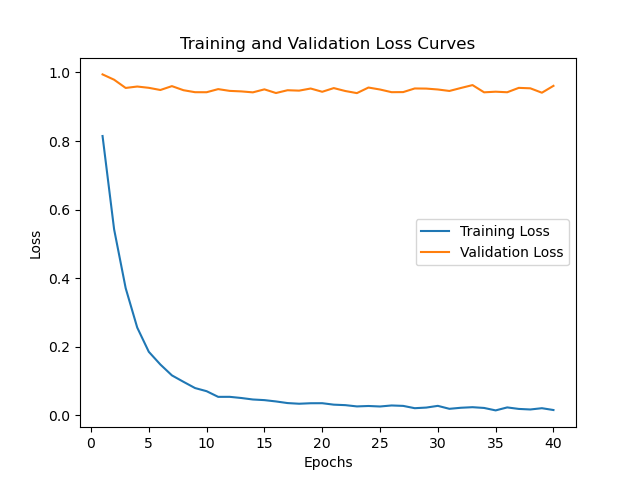

# My Project: Trad. Chinese Reading Comprehension Test for LLMs

## 程式執行

### 執行方法
- How to do:
    git clone整包code，並在有裝anaconda python 3.7.1以上環境下run code，細項的code在程式碼中有說明，在.ipynb file有做說明，也能在相關data上傳雲端，用colab上直接跑，不過如果是用colab跑，因為max_len有容量上限限制，所以精準度會下降，盡量限制maxlength在200以內下、batch size在16下跑。

## 1.做法說明

- Method:

    在資料的前處理的部分，我利用BertTokenizerFast的分詞器，先將paragrapth和question做分詞，並做 data embedding、data ecoding，將中文轉為tensor向量，並將data split成train_data和validation_data，其中我定義了一個自定義數據集類（MyDataset）來處理數據加載和分詞。數據集對輸入數據進行預處理，包括問題、段落、選項和正確答案，然後使用 BERT 分詞器進行分詞。
    接者，套用已預先訓練好的pretrain-model去做fine tune參數，以下用了幾個小技巧  

    1. Scheduled Sampling:    
    ```
    use_ground_truth = random.random() < scheduled_sampling_prob
    if use_ground_truth:
        # 使用實際標籤
        outputs = model(**inputs, labels=labels)
        logits = outputs.logits
    else:
        # 使用模型自己的預測
        outputs = model(**inputs)
        logits = outputs.logits
    ```

    在訓練過程中實現了定期抽樣，模型使用實際標籤或者根據指定的概率（scheduled_sampling_prob）使用自己的預測。這種技術有助於減低over-fitting，使模型在訓練過程中更加貼近test data。  
      

    2. Dropout:
    ```
    dropout_prob = 0.5
    model.classifier.dropout = torch.nn.Dropout(p=dropout_prob)
    ```

    採用dropout()的技巧，有助於減緩 overfitting 的產生，這次感覺測試的資料和訓練的資料答案有一定的差距，導致自己在Training的時候的validation accuracy達到0.8了，但上傳到Kaggle上卻只有0.53的準確率。  

    3. best-model saving:
    ```
    model.save_pretrained("best_model")
    ```   

    我有將眾多epoch數中，最好的validation fine-tune parameter存下來，以便後續接著training，可以將比較好的結果繼續留者，不用重新train，不過也有可能是導致overfitting的原因。
  
  
    再來就是training的基本配備，利用AdamW當作optimizer；crossentropy來當作計算loss的依據，訓練循環包括反向傳播、優化和模型參數的更新，以一個獨立的循環來評估模型對驗證集的表現，計算驗證損失和準確度。  

- analyze:
    以下為分析Llama2 和 BertForMultipleChoice的優缺點和精準度比較:
    |Llama2 model |BertForMultipleChoice|
    |-------------|---------------------|
    |模型大        |模型小               |
    |訓練時間久    |訓練時間相對快        |
    |準確率高      |準確率低             |

但有鑑於工作站和建立環境的因素，最後還是採用Bert的pretrain model去fine-tune Chinese Reading Comprehension Test的參數。

## 2.程式方塊圖與寫法

- 數據匯入和準備:
    導入Pytorch的library，包括 NumPy、PyTorch、Pandas、Matplotlib、torch 等，並將data數據load進來做資料的前處理，像是去除中文文本中的標點符號和空格，處理標點符號的問題，以用於訓練和測試，再使用 train_test_split 函數進行訓練集和驗證集的分割，將訓練數據分為訓練和驗證集。

- 文本轉換(encode):
    使用 BERT Fasttokenizer 將文本轉換為序列做編碼轉換為數值。再進行 zero-padding 以確保所有序列的長度相同。

- 建立 Transformer 模型:
    我使用模型包含使用 BERT 模型和 tokenizer 建立 Transformer 模型，定義模型的輸入和輸出層，訓練時，進行批次訓練，計算損失和準確率，在每個 epoch 結束後評估模型在驗證集上的表現。接者，套用已預先訓練好的pretrained-model去做fine tune參數，去訓練出適合做選擇題的model，以精準預設test data。

- 損失函數和優化器的定義:
    定義了loss function（crossentropy）來衡量模型的預測誤差。此外，使用優化器（AdamW）來在訓練過程中調整模型的參數，學習率調度含在內，以在訓練過程中調整學習率。

- 驗證:
    為了代碼訓練並評估定義的模型，我使用循環來迭代指定的訓練時期數。在每個時期內，都有訓練和驗證階段。在訓練階段，根據使用訓練數據計算的損失來更新模型的權重。驗證階段評估模型對單獨的驗證數據集的性能。訓練迴圈跟蹤各種指標，包括損失和準確性。根據最高驗證準確性保存最佳模型參數。在訓練過程中，調整學習率以優化模型性能，最後將預測結果保存到 CSV 檔案。

- 繪圖:
    使用 matplotlib 繪製訓練損失、驗證損失、訓練準確率和驗證準確率的圖表

## 3.畫圖做結果分析

### loss function 收斂曲線

    This is calculate the training and validation loss, the lower is better


- 討論:
    從上圖可以發現，隨著epoch數的增加，資料model有趨於overfitting的現象，這可能和因為將Data轉成tensor向量時，因為cuda長度限制，無法將所有的字存進來有關，導致後來越train，準確率無法再進一步提升，另外也有可能是我資料的前處理出問題，像是token的轉換應該要分段處理，因為paragraph和question都很長，不太可能一次Tokenize就能全部存下來，超出Cuda範圍的資訊就會被遺漏，沒有跟者train到，這不知道會不會也有影響。再來可能就是選用的model，或是fine-tune的parameters沒有找到一個比較合適的，因為後來我裝的環境出問題，所以只能用較小的Bert model，而不是用較大的語言學習model Llama2，這可能使一開始的training pre-parameter的資訊就產生的蠻大的差異了，這點是比較可惜的。

## 4.討論預設值誤差很大的，是怎麼回事?

- Model Complexity:

    這次因為Llama2 的前置環境一直處理不好，所以最後只能採用較小的Bert model，而不是用較大的語言學習 Llama2 model，model complexity可能不太足，預訓練的資料也相對的比較少，所以不容易 train 起來，validation set 的 accuracy 一直持平，無法進一步提升模型的預設精準度。

- 資料前處理:

    這次使用 BERT Fasttokenizer 將文本轉換為序列做編碼轉換為數值。再進行 zero-padding 以確保所有序列的長度相同，我覺得誤差大可能是我資料的前處理沒有到很完善，像是token的轉換應該要分段處理，因為paragraph和question都很長，不太可能一次 tokenize 就能全部存下來，超出Cuda範圍的資訊就會被遺漏，沒有跟者train到。另外，可以嘗試將圖形化出來，再去想可以對資料做什麼處理，例如分段、分詞的特別處理方法，考慮encode 時要用什麼寫法會是最有效率的，且不會影響到資料轉換 tensor 時的準確率。

- overfitting:

    這次從loss function figure可以明顯看出資料有overfitting的問題，在Training set可以Train 到 99% 但 validation set 到 78% 就持平上不去了，針對這個問題，我有嘗試用 Scheduled Sampling 和 Dropout 的方式去做改善，validation set是可以升到 80%，沒有明顯的進步，而且丟到Kaggle上的結果也只有50%，所以猜測是Bert model太小了。

## 5.如何改進?

- 前處理的優化:

    tokenize可以先做中文和特殊字元，再去以字元base來當成一個token，然後可以用word embedding 去使token的max_length低一點，然後字和字之間的相關性提高，可以進一步降低tokenizer的使用量和提升精準度，也能用word mask method去使model不會偷看到後面的資訊，可以train得比較好。主要step 可以依照以下步驟來進行: 1.word segmentation 2.split sentence to multiple subsentence 3.Tokeniced Chinese subsentence 4.Model predicted

- 尋找其他演算法或是和大語言模型訓練相關的Model

    使用 Bert model(相對Llama 2)為較小的訓練語言 model，一開始的起始 data 量就比較少，準確率會大大降低，加上本身工作站的 cuda 限制，每一次的 maxlength、batch size 等等，無法使整個文章和問題的 tokenized token 完全存入去做 training，不過這好像有一個解法是利用deepspeed方式去將資料放在CPU和GPU間轉換，可以增加資料量sequence length。對於看文章，做選擇題上可能不是到太好訓練，資料的處理上感覺還是沒有到像其他上台報告的同學那麼完善，所以之後可能可以找到更好的演算法，嘗試利用 Llama 2 去做 training ，或是在自定義的 model 裡疊更多層 activation function ，並適時加入 dropout() ，以降低 overfitting。

- 使用多種 pretrain model 交叉比對、stacking:

    試用不同的model交叉驗證策略，即將不同model的輸出，去比較各個比較高的機率值加起來最大，或是取每個model眾數(多數決)來當作結果的輸出，這樣可以進一步的提升預設的精準度，另外可以把所有model的輸出結果互相stacking，或是最後一層利用xgboost function將所有model做合併，這也是在國際競賽上大家常用的方法。

- Further visualization:

    不管在資料的前處理還是最後結果的分析上，如果能找到更適合的視覺化圖形幫助我們去分析數據，可能會對於Data-preprocessing、Batch_size Hyperparameter Tuning會有很大的幫助，可以了解不同特徵對模型的貢獻程度，或是探討如何字詞訓練的方法，進一步優化encode的處理。

## 6. 心得報告

- 報告心得:

    最後一次機器學習的作業，網路上蠻多Train 大語言學習相關的 open source，我覺得這次主要的困難點是在要找到好的pretrained model，而且是你的環境可以跑得為最主要關鍵，好的pretrained model預設精準度真的差很多，後面的fine tune參數反而是其次。資料的前處理部分好像也有差別，不過我怎麼改善好像也只有增加 3~4% 的精準度。Llama2安裝的環境解決不了， 所以只能用Bert相對較小的model去做training，導致最後可能會出現train 的效果不好。雖然最終結果可能不如預期，但從中其實也是學到不少，只是很可惜沒辦法在成果上表現出來。整學期的機器學習修下來，總結來說，真的學到很多新知識，從完全不懂AI，到自己可以train 一個大語言模型，真的很有成就感，謝謝教授整學期的用心教導和問題解惑，這門課難度剛好適合像我這個初學者，充滿挑戰但又可以剛好做出來，獲益良多。

## 7. reference

1. [Transformer-BertForMultipleChioce](https://github.com/huggingface/notebooks/blob/main/examples/multiple_choice.ipynb)

2. [大語言使用範例](https://hackmd.io/@hanasay/ry06G0bH6)

<!-- You can preview the rendered Markdown by pressing `Ctrl + Shift + V` in VSCode.
Adam optimizer: learning rate can change (decade step)
 -->
